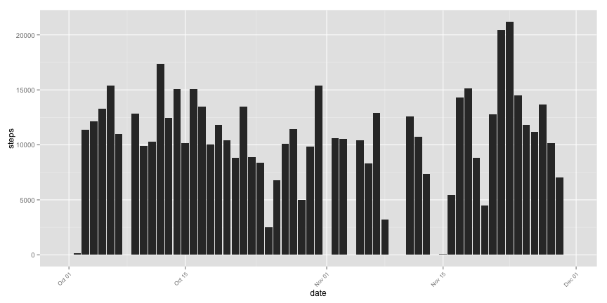
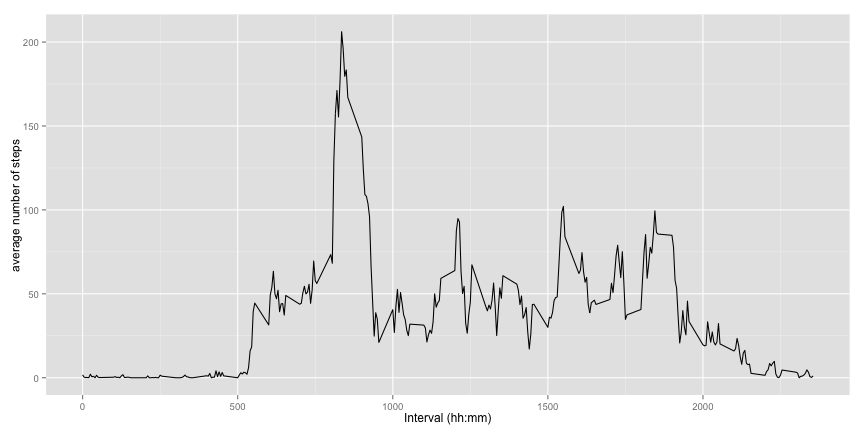
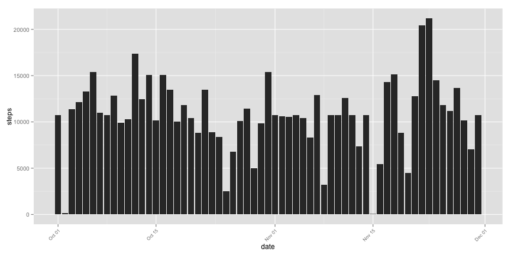
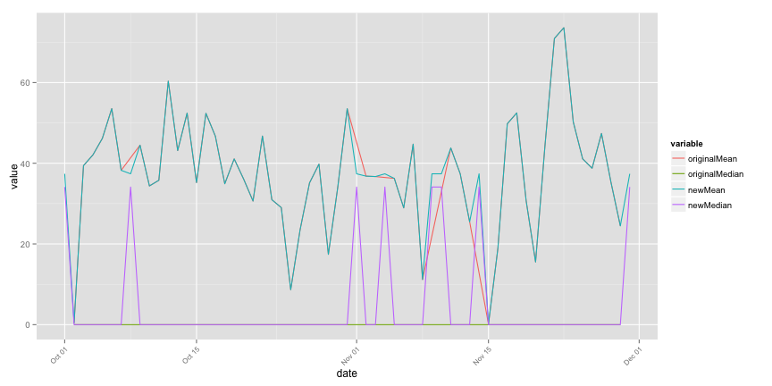
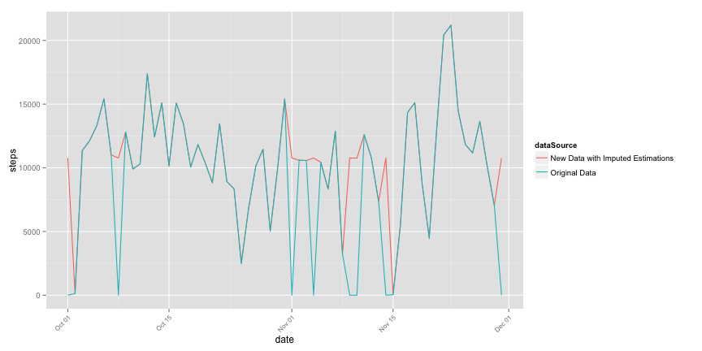
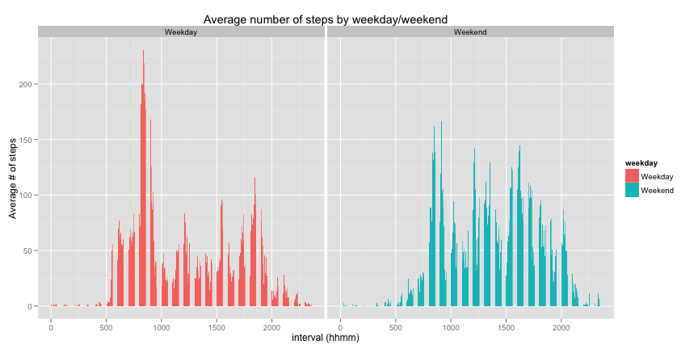

# Coursera - Data Science
## Reproducible Research - Assignment 1
#### Author - https://github.com/mgk2014/RepData_PeerAssessment1 
#### Date Completed - 13-Sep-2014


## Objective: 
This assignment makes use of data from a personal activity monitoring device as collected by various devices such as Fitbit, Nike or Jawbone. The source data can be downloaded from - https://d396qusza40orc.cloudfront.net/repdata%2Fdata%2Factivity.zip

The variables included in this dataset are:
* steps: Number of steps taking in a 5-minute interval (missing values are coded as NA)
* date: The date on which the measurement was taken in YYYY-MM-DD format
* interval: Identifier for the 5-minute interval in which measurement was taken

The data contains missing values, these will be addressed will be addressed depending on the type of question/insight sought from this data

Using a series of R tools, we will explore the relationship between date, time interval and physical activity indicated in the observations. The R tools used in this assignment are ggplot2, plyr, and reshape

## Assumptions
It is assumed that the source data has been downloaded and is located in the current working directory

# Script

## Set Global Options for R markdown

```r
opts_chunk$set(echo = TRUE, fig.width=12, fig.height=6, cache=TRUE)
```

## Load the required libraries


```r
require(plyr)
require(ggplot2)
require(reshape)
```

## Task 1 - Load the physical activity data
It is assumed that the source data resides in the current working directory

```r
unzip("activity.zip")
activity <- read.csv("activity.csv")
activity$date <- as.Date(activity$date) # change the date field to a factor variable
```

## Task 2 - Mean and Total Number of Steps Taken Per Day

### 2a. Make a histogram of the total number of steps taken each day

Use the PLYR package to compute the number of steps by day. Use ggplot bar to show the results


```r
totalStepsByDay <- ddply(activity, .(date), summarize, 
                        steps = sum(steps, na.rm=TRUE),
                        dataSource = "Original Data")

ggplot(totalStepsByDay, aes(date, steps)) + 
    geom_bar(stat = "identity") + 
    theme(axis.text.x = element_text(angle=45, hjust=1, size = 8))
```

 

### 2b. Mean and median of number of steps per day

Use the PLYR pacakge to compute the average number of steps by time interval within the day. 


```r
summary <- ddply(activity, .(date), summarize, 
                 originalMean = mean(steps, na.rm=TRUE), 
                 originalMedian = median(steps, na.rm=TRUE))
print(summary)
```

```
##          date originalMean originalMedian
## 1  2012-10-01          NaN             NA
## 2  2012-10-02       0.4375              0
## 3  2012-10-03      39.4167              0
## 4  2012-10-04      42.0694              0
## 5  2012-10-05      46.1597              0
## 6  2012-10-06      53.5417              0
## 7  2012-10-07      38.2465              0
## 8  2012-10-08          NaN             NA
## 9  2012-10-09      44.4826              0
## 10 2012-10-10      34.3750              0
## 11 2012-10-11      35.7778              0
## 12 2012-10-12      60.3542              0
## 13 2012-10-13      43.1458              0
## 14 2012-10-14      52.4236              0
## 15 2012-10-15      35.2049              0
## 16 2012-10-16      52.3750              0
## 17 2012-10-17      46.7083              0
## 18 2012-10-18      34.9167              0
## 19 2012-10-19      41.0729              0
## 20 2012-10-20      36.0938              0
## 21 2012-10-21      30.6285              0
## 22 2012-10-22      46.7361              0
## 23 2012-10-23      30.9653              0
## 24 2012-10-24      29.0104              0
## 25 2012-10-25       8.6528              0
## 26 2012-10-26      23.5347              0
## 27 2012-10-27      35.1354              0
## 28 2012-10-28      39.7847              0
## 29 2012-10-29      17.4236              0
## 30 2012-10-30      34.0938              0
## 31 2012-10-31      53.5208              0
## 32 2012-11-01          NaN             NA
## 33 2012-11-02      36.8056              0
## 34 2012-11-03      36.7049              0
## 35 2012-11-04          NaN             NA
## 36 2012-11-05      36.2465              0
## 37 2012-11-06      28.9375              0
## 38 2012-11-07      44.7326              0
## 39 2012-11-08      11.1771              0
## 40 2012-11-09          NaN             NA
## 41 2012-11-10          NaN             NA
## 42 2012-11-11      43.7778              0
## 43 2012-11-12      37.3785              0
## 44 2012-11-13      25.4722              0
## 45 2012-11-14          NaN             NA
## 46 2012-11-15       0.1424              0
## 47 2012-11-16      18.8924              0
## 48 2012-11-17      49.7882              0
## 49 2012-11-18      52.4653              0
## 50 2012-11-19      30.6979              0
## 51 2012-11-20      15.5278              0
## 52 2012-11-21      44.3993              0
## 53 2012-11-22      70.9271              0
## 54 2012-11-23      73.5903              0
## 55 2012-11-24      50.2708              0
## 56 2012-11-25      41.0903              0
## 57 2012-11-26      38.7569              0
## 58 2012-11-27      47.3819              0
## 59 2012-11-28      35.3576              0
## 60 2012-11-29      24.4688              0
## 61 2012-11-30          NaN             NA
```

#### Observation: 
While mean indicates a reasonable spread the median is 0 across the days. This is due to large number of readins with 0 values.

## Task 3 - Average Daily Pattern

### 3a. Time series plot of 5 minute intervals

Time series plot (i.e. type = "l") of the 5-minute interval (x-axis) and the average number of steps taken, averaged across all days (y-axis)


```r
avgStepsByInterval <- ddply(activity, .(interval), summarize, 
            mean = mean(steps, na.rm=TRUE))

qplot(interval, mean, data = avgStepsByInterval, 
      geom = "line", stat = "identity", xlab = "Interval (hh:mm)", 
      ylab = "average number of steps")
```

 

### 3b. Time interval with maximum number of steps


```r
timeInterval <- avgStepsByInterval[which.max(avgStepsByInterval$mean),1]
```
Time interval with maximum number of steps is 835 (hhmm)

## TASK 4 - Imputing Missing Values

We will use the interval based mean averages to populate missing values. This will be computed using PLYR and a new data set will be created by merging average means, with the observations that contain missing values. The new data set will be merged with the original activity data set to create a newActivity data set

### 4a. Total number of missing values


```r
naActivity <- activity[is.na(activity$steps), ]
totalNARows <- nrow(naActivity)
```
Total number of missing recordings for steps in the dataset is 2304

### 4b. Estimate missing values


```r
avgOfIntervals <- ddply(activity, .(interval), summarize, 
                        mean = mean(steps, na.rm=TRUE))
mergedIntevals <- merge(naActivity, avgOfIntervals, 
                        naActivity.x = "interval",
                        avgOfIntervals.y = "interval")
mergedIntevals$steps <- mergedIntevals$mean
mergedIntevals$mean <- NULL
```

### 4c. Create new data set with estimated values filled in

```r
newActivity <- rbind(activity[!is.na(activity$steps), ], mergedIntevals )
```

### 4d. Plot new estimated values for missing values
Let us plot the newly updated and estimated values of number of steps, where values were missing.

```r
newTotalStepsByDay <- ddply(newActivity, .(date), summarize, 
      steps = sum(steps, na.rm=TRUE))

ggplot(newTotalStepsByDay, aes(date, steps)) + 
    geom_bar(stat = "identity") + 
    theme(axis.text.x = element_text(angle=45, hjust=1, size = 8))
```

 

#### Observations
This histogram, does not do a good job of comparing the new estimated values to the original observations

#### Calculate the new mean, median and plot the difference with the original mean, median

```r
newSummary <- ddply(newActivity, .(date), summarize, 
                newMean = mean(steps, na.rm=TRUE), 
                newMedian = median(steps, na.rm=TRUE))
print(newSummary)
```

```
##          date newMean newMedian
## 1  2012-10-01 37.3826     34.11
## 2  2012-10-02  0.4375      0.00
## 3  2012-10-03 39.4167      0.00
## 4  2012-10-04 42.0694      0.00
## 5  2012-10-05 46.1597      0.00
## 6  2012-10-06 53.5417      0.00
## 7  2012-10-07 38.2465      0.00
## 8  2012-10-08 37.3826     34.11
## 9  2012-10-09 44.4826      0.00
## 10 2012-10-10 34.3750      0.00
## 11 2012-10-11 35.7778      0.00
## 12 2012-10-12 60.3542      0.00
## 13 2012-10-13 43.1458      0.00
## 14 2012-10-14 52.4236      0.00
## 15 2012-10-15 35.2049      0.00
## 16 2012-10-16 52.3750      0.00
## 17 2012-10-17 46.7083      0.00
## 18 2012-10-18 34.9167      0.00
## 19 2012-10-19 41.0729      0.00
## 20 2012-10-20 36.0938      0.00
## 21 2012-10-21 30.6285      0.00
## 22 2012-10-22 46.7361      0.00
## 23 2012-10-23 30.9653      0.00
## 24 2012-10-24 29.0104      0.00
## 25 2012-10-25  8.6528      0.00
## 26 2012-10-26 23.5347      0.00
## 27 2012-10-27 35.1354      0.00
## 28 2012-10-28 39.7847      0.00
## 29 2012-10-29 17.4236      0.00
## 30 2012-10-30 34.0938      0.00
## 31 2012-10-31 53.5208      0.00
## 32 2012-11-01 37.3826     34.11
## 33 2012-11-02 36.8056      0.00
## 34 2012-11-03 36.7049      0.00
## 35 2012-11-04 37.3826     34.11
## 36 2012-11-05 36.2465      0.00
## 37 2012-11-06 28.9375      0.00
## 38 2012-11-07 44.7326      0.00
## 39 2012-11-08 11.1771      0.00
## 40 2012-11-09 37.3826     34.11
## 41 2012-11-10 37.3826     34.11
## 42 2012-11-11 43.7778      0.00
## 43 2012-11-12 37.3785      0.00
## 44 2012-11-13 25.4722      0.00
## 45 2012-11-14 37.3826     34.11
## 46 2012-11-15  0.1424      0.00
## 47 2012-11-16 18.8924      0.00
## 48 2012-11-17 49.7882      0.00
## 49 2012-11-18 52.4653      0.00
## 50 2012-11-19 30.6979      0.00
## 51 2012-11-20 15.5278      0.00
## 52 2012-11-21 44.3993      0.00
## 53 2012-11-22 70.9271      0.00
## 54 2012-11-23 73.5903      0.00
## 55 2012-11-24 50.2708      0.00
## 56 2012-11-25 41.0903      0.00
## 57 2012-11-26 38.7569      0.00
## 58 2012-11-27 47.3819      0.00
## 59 2012-11-28 35.3576      0.00
## 60 2012-11-29 24.4688      0.00
## 61 2012-11-30 37.3826     34.11
```

To calculate difference of new and old means, let us create a line chart comparing the mean/medians before/after updating the estimated values. The RESHAPE melt function is used to be able to create different lines for original v/s new mean/medians


```r
df <- merge(summary, newSummary, by.x = "date", by.y = "date")
activityMelt <- melt(df, id = c("date"), 
                     measures.vars = c("originalMean", "originalMedian", 
                                       "newMean", "newMedian"))
activityMelt <- activityMelt[!is.na(activityMelt$value),]

ggplot(activityMelt, aes(date, value, group = variable)) +
    geom_line(aes(colour = variable))+
    theme(axis.text.x = element_text(angle=45, hjust=1, size = 8))
```

 

#### Observations
The estimations indicate significant differences between medians, however the means do not show a significant change when compared to the original observations.

### Change in total number of steps

Check if the number of steps have changed as a result of the estimations.


```r
originalTotalSteps <- sum(activity$steps, na.rm=TRUE)
newTotalSteps <- as.integer(sum(newActivity$steps))
```

The original total steps were 570608. The new total steps estimated were 656737.

#### Plot the difference in total number of steps by day


```r
newTotalStepsByDay <- ddply(newActivity, .(date), summarize, 
                            steps = sum(steps, na.rm=TRUE), 
                            dataSource ="New Data with Imputed Estimations")
newTotalStepsByDay <- rbind(newTotalStepsByDay, totalStepsByDay)

ggplot(newTotalStepsByDay, aes(date, steps, group = dataSource)) +
    geom_line(aes(colour = dataSource)) + 
    theme(axis.text.x = element_text(angle=45, hjust=1, size = 8))
```

 

#### Observation: This plot better indicates the impact of newly estimated values, as the differences in totals before and after estimattions are significant.

## TASK 5 - Differences in Activity Patters between weekday and weekends

### 5a. Impute weekday v/s weekend

Prepare data by determine weekday and then assigning weekday v/s weekend depending on the value of weekday


```r
newActivity$weekday <- weekdays(newActivity$date)
newActivity$weekday <- ifelse(newActivity$weekday %in% c("Sunday", "Saturday"), "Weekend", "Weekday")
```

### 5b. Create a panel plot

Create a panel plot by calculating the value average # of steps by interval within the newly estimated data-set and split panels by weekday/weekend


```r
newAvgStepsByInterval <- ddply(newActivity, .( weekday, interval), summarize, 
            mean = mean(steps, na.rm=TRUE))

ggplot(newAvgStepsByInterval, aes(interval, mean, fill = weekday)) +
    geom_bar(stat = "identity") +
    facet_wrap(~ weekday) + 
    labs(x = "interval (hhmm)", y = "Average # of steps",
         title = "Average number of steps by weekday/weekend")
```

 

#### Observations
Weekday/Weekend break indicates a higher number of average # of steps on weekday mornings, however a more uniform distribution during weekend days.
