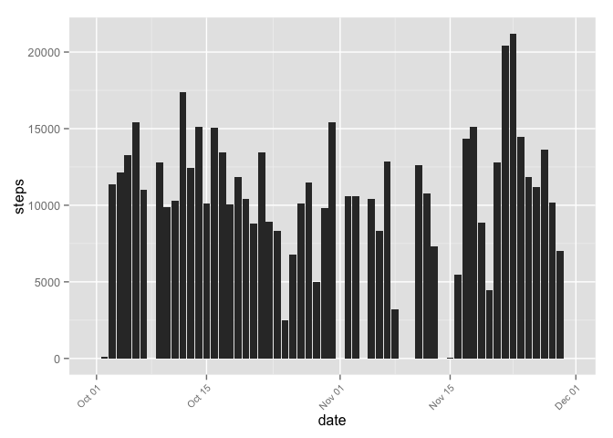
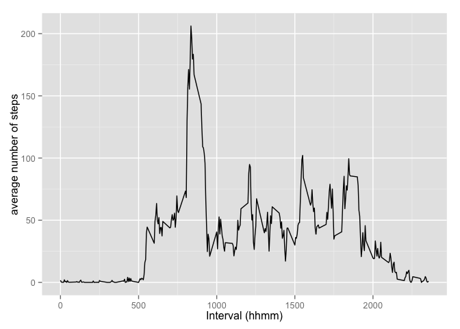
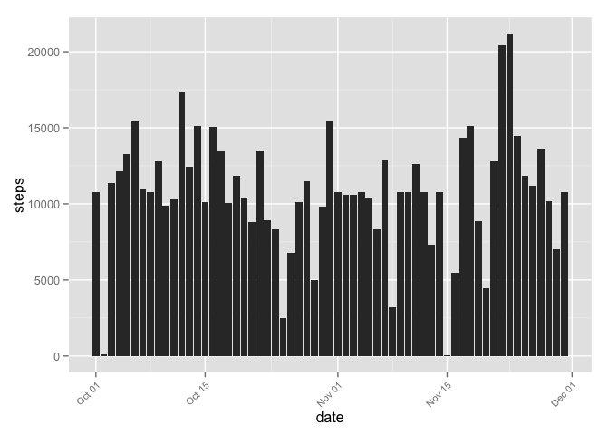
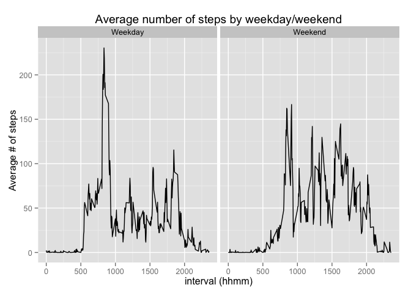

## Coursera - Data Science 
## Reproducible Research - Assignment 1
#### Author - https://github.com/mgk2014/RepData_PeerAssessment1 
#### Date Completed - 13-Sep-2014


### Objective: 
This assignment makes use of data from a personal activity monitoring device as collected by various devices such as Fitbit, Nike or Jawbone. The source data can be downloaded from - https://d396qusza40orc.cloudfront.net/repdata%2Fdata%2Factivity.zip

The variables included in this dataset are:
* steps: Number of steps taking in a 5-minute interval (missing values are coded as NA)
* date: The date on which the measurement was taken in YYYY-MM-DD format
* interval: Identifier for the 5-minute interval in which measurement was taken

The data contains missing values, these will be addressed will be addressed depending on the type of question/insight sought from this data

Using a series of R tools, we will explore the relationship between date, time interval and physical activity indicated in the observations. The R tools used in this assignment are ggplot2, plyr, and reshape

### Assumptions
It is assumed that the source data has been downloaded and is located in the current working directory

### Set Global Options for R markdown


```r
#knitr::opts_chunk$set(echo = TRUE, fig.width=12, fig.height=8, include=TRUE, results=TRUE)
options("scipen"=100, "digits"=4)
```

### Load the required libraries


```r
require(plyr)
```

```
## Loading required package: plyr
```

```r
require(ggplot2)
```

```
## Loading required package: ggplot2
```

```r
require(reshape)
```

```
## Loading required package: reshape
## 
## Attaching package: 'reshape'
## 
## The following objects are masked from 'package:plyr':
## 
##     rename, round_any
```

### Task 1 - Load the physical activity data

It is assumed that the source data resides in the current working directory


```r
unzip("activity.zip")
activity <- read.csv("activity.csv")
activity$date <- as.Date(activity$date) # change the date field to a factor variable
```

### Task 2 - Mean and Total Number of Steps Taken Per Day

#### 2a. Make a histogram of the total number of steps taken each day


```r
totalStepsByDay <- ddply(activity, .(date), summarize, 
                        steps = sum(steps, na.rm=TRUE),
                        dataSource = "Original Data")

ggplot(totalStepsByDay, aes(date, steps)) + 
    geom_bar(stat = "identity",  binwidth = 1) + 
    theme(axis.text.x = element_text(angle=45, hjust=1, size = 8))
```

 

#### 2b. Mean and median of number of steps per day


```r
meanSteps <- mean(activity$steps, na.rm=TRUE)
medianSteps <- median(activity$steps, na.rm=TRUE)
totalSteps <- sum(activity$steps, na.rm = TRUE)
```

* mean of all steps ``37.3826``
* median of all steps ``0``
* Total number of steps ``570608``

### Task 3 - Average Daily Pattern

#### 3a. Time series plot of 5 minute intervals

Time series plot (i.e. type = "l") of the 5-minute interval (x-axis) and the average number of steps taken, averaged across all days (y-axis)


```r
avgStepsByInterval <- ddply(activity, .(interval), summarize, 
            mean = mean(steps, na.rm=TRUE))

qplot(interval, mean, data = avgStepsByInterval, 
      geom = "line", stat = "identity", xlab = "Interval (hhmm)", 
      ylab = "average number of steps")
```

 

#### 3b. Time interval with maximum number of steps


```r
timeInterval <- avgStepsByInterval[which.max(avgStepsByInterval$mean),1]
```
Time interval with maximum number of steps is 835 (expressed as 'hhmm')

### TASK 4 - Imputing Missing Values

We will use the interval based mean averages to populate missing values. This will be computed using PLYR and a new data set will be created by merging average means, with the observations that contain missing values. The new data set will be merged with the original activity data set to create a newActivity data set

#### 4a. Total number of missing values


```r
naActivity <- activity[is.na(activity$steps), ]
totalNARows <- nrow(naActivity)
```
Total number of missing recordings for steps in the dataset is 2304

#### 4b. Estimate missing values


```r
avgOfIntervals <- ddply(activity, .(interval), summarize, 
                        mean = mean(steps, na.rm=TRUE))
mergedIntevals <- merge(naActivity, avgOfIntervals, 
                        naActivity.x = "interval",
                        avgOfIntervals.y = "interval")
mergedIntevals$steps <- mergedIntevals$mean
mergedIntevals$mean <- NULL
```

#### 4c. Create new data set with estimated values filled in

```r
newActivity <- rbind(activity[!is.na(activity$steps), ], mergedIntevals )
```

#### 4d. Plot new estimated values for missing values
Let us plot the newly updated and estimated values of number of steps, where values were missing.

```r
newTotalStepsByDay <- ddply(newActivity, .(date), summarize, 
      steps = sum(steps, na.rm=TRUE))

ggplot(newTotalStepsByDay, aes(date, steps)) + 
    geom_bar(stat = "identity") + 
    theme(axis.text.x = element_text(angle=45, hjust=1, size = 8))
```

 

#### Calculate the new mean, median 

```r
newMeanSteps <- mean(newActivity$steps, na.rm=TRUE)
newMedianSteps <- median(newActivity$steps, na.rm=TRUE)
newTotalSteps <- as.integer(sum(newActivity$steps, na.rm = TRUE))
```

* mean steps of new imputed values ``37.3826``, the old mean was ``37.3826``
* median steps of new imputed values ``0``, the old median was ``0``

#### Observations
The mean, median remain unchanged, even though the total number of steps has increased by ``86129``

### Change in total number of steps
The original total steps were 570608. The new total steps estimated are 656737.

### TASK 5 - Differences in Activity Patters between weekday and weekends

#### 5a. Impute weekday v/s weekend

Prepare data by determine weekday and then assigning weekday v/s weekend depending on the value of weekday


```r
newActivity$weekday <- weekdays(newActivity$date)
newActivity$weekday <- ifelse(newActivity$weekday %in% c("Sunday", "Saturday"), "Weekend", "Weekday")
```

#### 5b. Create a panel plot

Create a panel plot by calculating the value average # of steps by interval within the newly estimated data-set and split panels by weekday/weekend


```r
newAvgStepsByInterval <- ddply(newActivity, .( weekday, interval), summarize, 
            mean = mean(steps, na.rm=TRUE))

ggplot(newAvgStepsByInterval, aes(interval, mean, fill = weekday)) +
    geom_line(stat = "identity") +
    facet_wrap(~ weekday) + 
    labs(x = "interval (hhmm)", y = "Average # of steps",
         title = "Average number of steps by weekday/weekend")
```

 

#### Observations
Weekday/Weekend break indicates a higher number of average # of steps on weekday mornings, however a more uniform distribution during weekend days.
